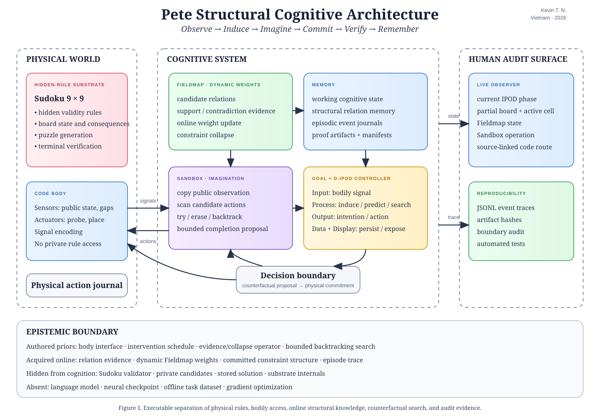

# Pete Structural Cognitive Architecture

## Independent Conceptual Derivation and an Executable Sudoku Study

**Kevin T. N.**  
Epistemologist, Vietnam  
September 2026

## Author's declaration of origin

The author declares that the conceptual architecture in this paper was independently derived from his own analysis of cognition, embodiment, structural change, memory, imagination, goals, and interaction with objective reality. No existing artificial-intelligence architecture was used as a conceptual design reference. This independence was intentional: the architecture was developed from the author's own reasoning before any attempt to relate it to established model families.

OpenAI Codex was used as a technical implementation assistant. Its role was to translate the author's specifications into executable code, organize files, inspect runtime processes, implement the observer interface, run tests and audits, preserve traces, and assist with technical writing. Codex did not originate the architecture's principles. The conceptual contribution is attributed to Kevin T. N.; the implementation record identifies where technical assistance was used.

This declaration concerns conceptual provenance. It does not claim that every low-level programming operation—such as recursion, search, data serialization, HTTP serving, or browser rendering—is historically novel.

## Abstract

This paper specifies Pete, an executable structural cognitive architecture, through a controlled 9 × 9 Sudoku environment. Pete separates the objective executable world from the agent's internal representations. A hidden-rule **substrate** contains physical state and determines the consequences of actions. A code-defined **body** is the only channel by which Pete observes and acts on that substrate. A **Fieldmap** stores explicit evidence-bearing relations whose weights change during the agent's lifetime. A bounded **Sandbox** permits reversible counterfactual operations without modifying the physical world. Memory stores current state, acquired structure, and event history. A D-IPOD controller organizes Display, Input, Process, Output, and Data into a continuing cycle.

The implementation uses no language model, pretrained neural checkpoint, offline task-training dataset, or gradient optimization. This does not mean the program has no prior structure. Its sensor and actuator interfaces, intervention schedule, evidence-update mechanism, collapse conditions, and generic finite-domain search are authored mechanisms. Sudoku constraints are held inside the substrate and are excluded from cognition. During interaction, Fieldmap acquires dynamically weighted task relations; the Sandbox uses those relations to construct a candidate completion; the body then commits actions to the substrate for physical verification.

The repository preserves source code, automated boundary tests, physical journals, Sandbox traces, manifests, and a live source-linked observer. An archived run contains 104 Sandbox events and 51 attempted assignments from `BEGIN` to `COMPLETE`. This result demonstrates the execution of one bounded structural-learning path. It does not establish general intelligence, autonomous invention of the search procedure, statistical accuracy, or superiority over another system.

## 1. Research objective

The experiment asks:

> Can a system that lacks Sudoku rules in cognition acquire usable constraint structure through bodily interaction with a hidden-rule environment, retain that structure as explicit dynamic relations, and use it to produce a physically verified completion?

The experiment is designed around a distinction among three things:

1. **Architecture:** the durable mechanisms by which the system can sense, change, learn, imagine, decide, and remember.
2. **Knowledge:** the runtime structure formed when observations alter Fieldmap and memory.
3. **World law:** the hidden executable conditions that determine consequences inside the substrate.

The experiment succeeds only if these remain technically separable.

## 2. Core ontology

### 2.1 Substrate

The substrate is the executable world in which an action has consequences. In this study it contains the 9 × 9 board, generated instances, hidden validity conditions, state transitions, and the terminal success condition.

The substrate is not Pete's belief about Sudoku. It is the environment against which beliefs and proposed actions can fail. Public observations must therefore exclude private constraints, private candidate sets, explanations generated from hidden rules, and stored solutions.

### 2.2 Code body

The body is the system's physical structure in the digital world. It contains code-defined sensors, encoders, transport channels, actuators, and viability signals. It mediates every permitted exchange with the substrate.

The body has two directions:

- sensing converts accessible substrate changes into bounded signals;
- acting converts a selected intention into an allowed physical operation.

Because cognition only receives bodily signals, information loss and channel design are part of the experiment rather than incidental implementation details.

### 2.3 Fieldmap

Fieldmap is the current relational organization of acquired evidence. It is a dynamic structure rather than a fixed lookup table or pretrained tensor. Each operative relation has inspectable support, contradiction history, and a mutable strength.

At time \(t\), let

\[
C_t = (F_t, M_t, G_t, V_t),
\]

where \(F_t\) is Fieldmap, \(M_t\) is memory, \(G_t\) is the active goal structure, and \(V_t\) is bodily viability state. After action \(a_t\), the body receives observation \(o_{t+1}\). A gap operator compares expected and obtained structure:

\[
g_t = \Delta(\hat{o}_{t+1}, o_{t+1}).
\]

Fieldmap then changes according to the implemented update mechanism:

\[
F_{t+1} = U(F_t, o_t, a_t, o_{t+1}, g_t).
\]

These equations define dependencies, not invented performance mathematics. The source code remains the authoritative definition of \(\Delta\) and \(U\).

### 2.4 Dynamic weights

Pete starts without trained neural weights. After interaction, Fieldmap contains dynamic relation weights. These are not dense latent matrices. Each weight belongs to an explicit relation and changes because recorded evidence supports or contradicts that relation.

The distinction is:

- **authored constants:** channel definitions, thresholds, update operations, budgets, and schedules;
- **dynamic cognitive weights:** runtime strengths of evidence-bearing relations;
- **acquired knowledge:** the organized relation structure that becomes usable for prediction and constraint;
- **hidden world rules:** the substrate's executable validity conditions.

### 2.5 Memory

Pete's data is not treated as a passive archive detached from process. An interaction changes the system, and that changed organization becomes part of the state that processes later input.

The reference experiment uses:

- working state for the current observation, phase, intention, and counterfactual;
- structural memory for induced relations and their evidence;
- episodic journals for ordered physical and Sandbox events;
- immutable proof artifacts for selected traces, manifests, and recordings.

The present experiment does not yet demonstrate general semantic compression, lifelong forgetting, or transfer across unrelated domains.

### 2.6 Imagination and Sandbox

Imagination is the system-level capacity to form and transform possibilities that are not currently physical. The Sandbox is its bounded executable realization in this experiment.

The Sandbox copies public state, tries assignments, removes failed assignments, and backtracks. These transformations change only a counterfactual workspace. The Sandbox cannot import the substrate, call its hidden validator, or obtain a solution object. A proposal becomes physically meaningful only after commitment through the body.

### 2.7 Goal and viability

A goal is represented as an active organizing condition, not merely a hard-coded command string. The controller uses current state, unresolved gaps, viability, and acquired structure to determine which process should receive attention.

The Sudoku artifact still contains an authored experimental scheduler. It therefore demonstrates goal-directed execution inside a prepared task environment, not fully autonomous goal creation.

## 3. D-IPOD organization

Pete is organized as recursively composable D-IPOD cycles:

- **Display:** exposes internal and physical state for an observer;
- **Input:** receives a bodily signal or the output of another process;
- **Process:** transforms structure, induces a relation, evaluates a possibility, or selects an action;
- **Output:** emits an internal result, intention, or physical action;
- **Data:** retains the resulting structural and episodic change.

An output from one cycle may become the input of another. A complete cycle may itself be treated as one process inside a wider cycle. The executable reference runtime orders phases for auditability; the conceptual architecture permits multiple processes to operate over different signals or the same signal.

## 4. Executable process chain

### 4.1 Initialization

A clean runtime contains no learned task relations or parameter checkpoint. The substrate creates a board and retains its private state. Cognition receives only the initial public observation.

### 4.2 Physical experiment

The scheduler selects an intervention. The intention passes through the body, the substrate computes its consequence, and the body returns a bounded signal. The physical journal records the action and response.

### 4.3 Gap formation and relation update

Pete compares predicted and observed consequences. The resulting gap updates support or contradiction evidence attached to candidate relations. When authored evidence conditions are met, an operative relation can collapse from unresolved possibility into current usable structure.

Collapse is revisable. It expresses the system's current evidence organization rather than changing the substrate's law.

### 4.4 Counterfactual construction

Once Fieldmap supplies usable constraint relations, the Sandbox starts a bounded finite-domain search. It emits explicit operations:

- `BEGIN` initializes a public-board copy;
- `SCAN` selects an unresolved location;
- `TRY` adds a possible assignment;
- `BACKTRACK` removes an assignment after a dead end;
- `COMPLETE` returns a candidate board;
- `BUDGET_STOP` terminates an incomplete search honestly.

The backtracking mechanism is authored. The experiment does not claim that Pete discovered recursion or search. Its learned component is the task relation structure used to constrain that search.

### 4.5 Physical commitment and verification

Sandbox completion is not equivalent to truth. Selected assignments are expressed through body actions. The substrate admits or rejects them under its hidden rules. The runtime records success only after substrate-level verification.

### 4.6 Data persistence and display

Every meaningful phase produces inspectable state. The observer displays current D-IPOD phase, Fieldmap status, partial Sandbox board, active cell, current operation, recent trace, and the responsible source route. Display pacing is instrumentation; it is not allowed to supply choices to cognition.

## 5. Implementation boundary

| Element | Present before execution | Changes online | Classification |
|---|---:|---:|---|
| 9 × 9 coordinates and value symbols | Yes | No | Authored task interface |
| Hidden validity logic | Yes | Physical state changes | Substrate law |
| Sensor and actuator encoding | Yes | Runtime state | Authored body mechanism |
| Intervention schedule | Yes | Cursor advances | Authored exploration mechanism |
| Evidence update and collapse operation | Yes | Counters and states change | Authored learning mechanism |
| Committed Sudoku constraint knowledge in cognition | No | Yes | Acquired Fieldmap structure |
| Dynamic relation weights | No trained values | Yes | Acquired lifetime weights |
| Reversible finite-domain search | Yes | Search state changes | Authored Sandbox mechanism |
| Sudoku solution accessible to cognition | No | No | Forbidden information |
| LLM, neural checkpoint, gradient optimizer | No | No | Absent |

## 6. Evidence

The repository contains the following recorded evidence:

- an archived Sandbox trace containing 104 events and 51 attempted assignments from `BEGIN` through `COMPLETE`;
- a manifest binding that trace to source revision `17219bd`;
- SHA-256 `69d738b1234782480cda3bf0d6b3901d180d081508f6cbc941d4143d284df0db` for the archived trace;
- a recorded empty-runtime-to-solved observer run;
- 12 passing automated tests at the last recorded checkpoint;
- a passing module-boundary audit at that checkpoint.

These are raw artifact observations. They do not constitute an accuracy percentage or a comparison with another model.

## 7. Falsification conditions

| Statement | Falsifying evidence |
|---|---|
| Cognition lacks hidden Sudoku rules | A reachable validator, solution, or encoded row/column/region rule exists in cognition |
| Fieldmap knowledge forms online | Task relations are already committed before interaction |
| Sandbox is isolated | It imports substrate code or receives a validator/solution callback |
| Counterfactual execution is stepwise | The trace jumps directly from initial state to completion |
| Success is physically verified | Cognition can declare success without substrate admission |
| No pretrained task parameters are required | A clean run requires a checkpoint or prior learned artifact |

## 8. Limitations

The current artifact is deliberately narrow.

1. Sudoku is deterministic, discrete, and finite.
2. Coordinates, values, body channels, intervention scheduling, evidence operations, and search are designed.
3. Pete does not yet derive its own sensor ontology from raw pixels or unstructured motor signals.
4. The system has not demonstrated discovery of the backtracking mechanism.
5. One archived complete trace cannot estimate reliability.
6. The current dynamic weights have only been demonstrated inside this task family.
7. No claim about consciousness, general intelligence, or autonomous self-development follows from this experiment.

## 9. Required next experiments

A stronger empirical paper requires a preregistered evaluation with all runs retained. At minimum:

1. multiple fixed seeds and difficulty strata;
2. Fieldmap-disabled ablation;
3. shuffled action-consequence evidence;
4. collapse-disabled ablation;
5. backtracking-disabled Sandbox;
6. controlled intervention budgets;
7. transfer of learned relations to unseen 9 × 9 boards;
8. a deliberate leakage mutation that the boundary audit must detect.

Report substrate interventions, relation states, Sandbox attempts, backtracks, physical commitments, completion status, runtime, failures, and artifact hashes. Do not remove failed runs from the denominator.

## 10. Repository map

| Function | Path |
|---|---|
| Operating and experiment constraints | `AGENTS.md` |
| Hidden-rule substrate | `src/pete_discovery/substrate.py` |
| Code body | `src/pete_discovery/body.py` |
| Dynamic Fieldmap | `src/pete_discovery/fieldmap.py` |
| Cognitive orchestration | `src/pete_discovery/cognition.py` |
| Sandbox | `src/pete_discovery/sandbox.py` |
| Runtime and journals | `src/pete_discovery/runtime.py` |
| Observer server | `src/pete_discovery/server.py` |
| Visual observer | `static/` |
| Automated checks | `tests/` |
| Archived proof material | `artifacts/proof/` |
| Plans, checkpoints, and design logs | `docs/` |

## 11. Reproducibility protocol

1. Check out the exact reported source revision.
2. Confirm that no runtime state or parameter checkpoint is present.
3. Run the automated tests and boundary audit.
4. Start the observer using the repository command documented in `README.md`.
5. Start one clean experiment.
6. Preserve the complete physical and Sandbox journals.
7. Hash every proof artifact.
8. Report environment, dependency versions, seed, source revision, success or failure, and raw operation counts.

## 12. Conclusion

The implemented result is specific: Pete can acquire explicit dynamic constraint relations during interaction with a hidden-rule 9 × 9 Sudoku substrate, use those relations inside an isolated counterfactual Sandbox, and submit a completion for physical verification. The architecture contains substantial authored machinery, and the paper names it. The knowledge formed during execution is separated from that machinery and from the world's hidden laws.

The contribution is therefore an inspectable structural architecture and a falsifiable experimental boundary. Broader claims remain open until they are supported by transfer, ablation, repeated-run, and leakage-control evidence.

## Assistance disclosure

Conceptual architecture and first-principles decomposition: **Kevin T. N.**  
Technical implementation, code organization, testing support, runtime tracing, interface construction, and documentation assistance: **OpenAI Codex under the author's direction.**

